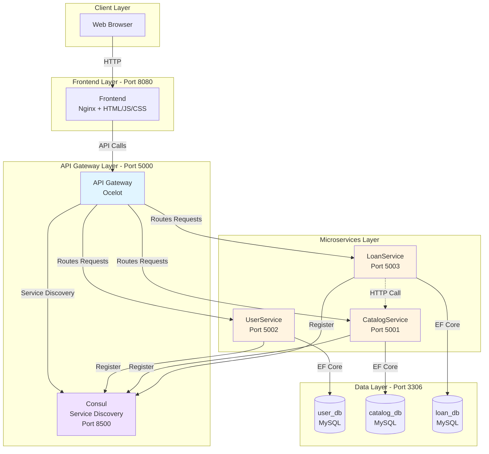
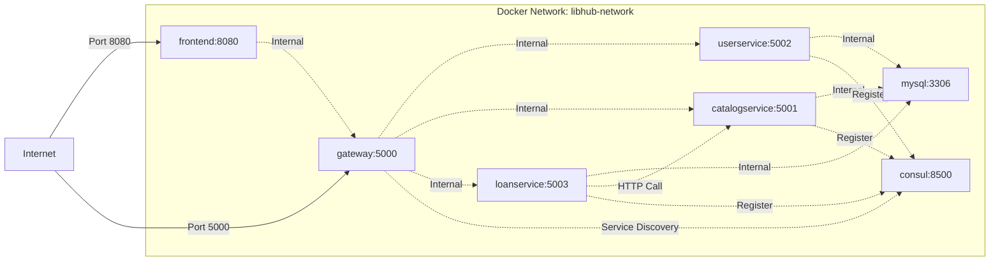
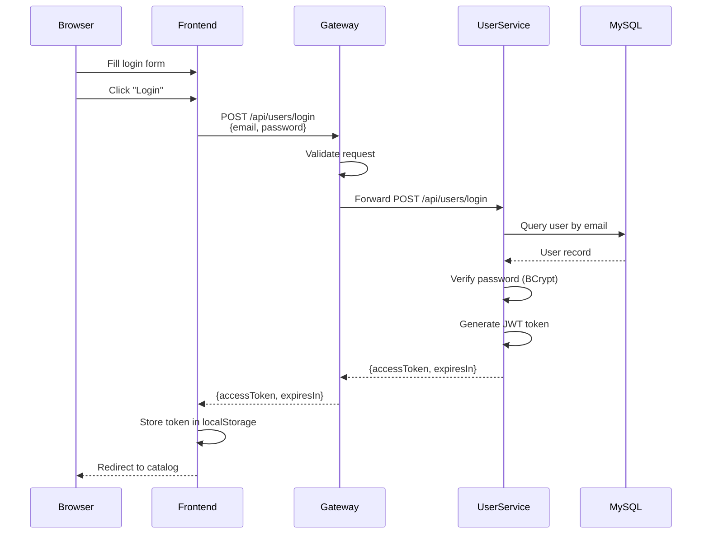
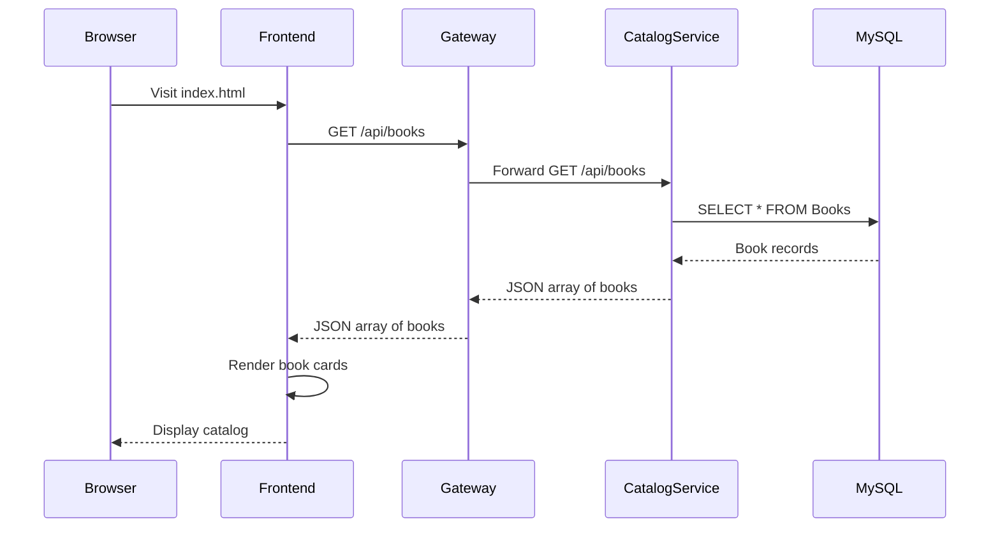
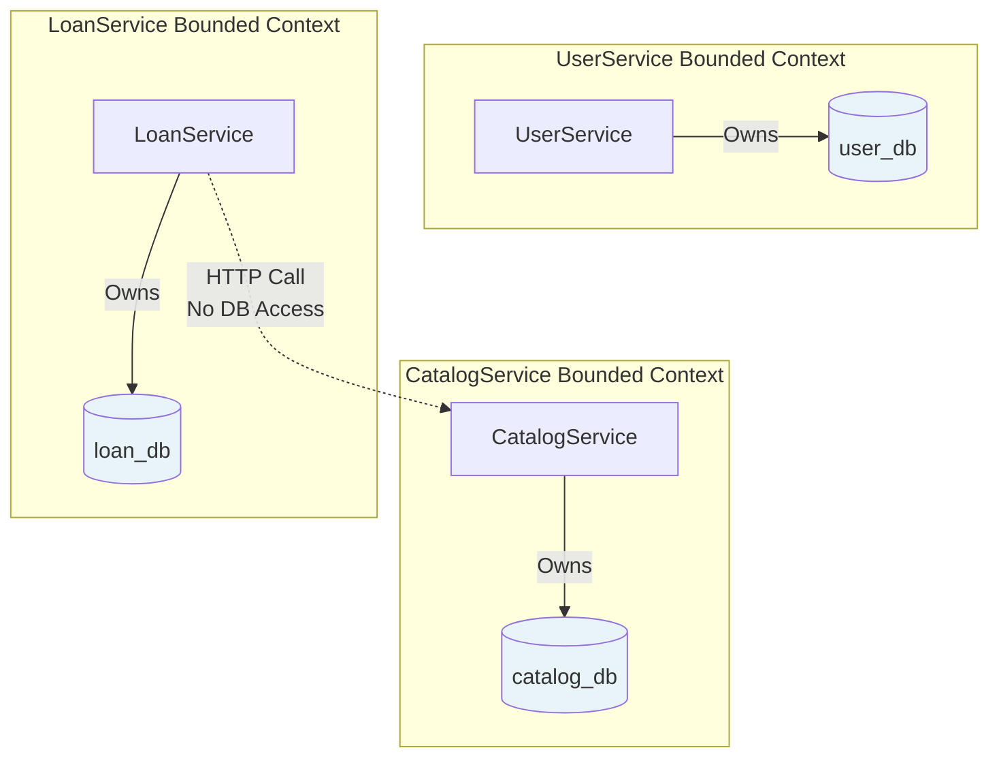

# Architecture Layer 1: System Overview

## What You'll Learn

This document provides a high-level view of the LibHub system architecture. You'll understand:
- How all 5 components fit together
- Network communication and port mapping
- Where each component lives in the codebase
- Basic request flow from frontend to database

## System Architecture Diagram



## Component Breakdown

### 1. Frontend (Port 8080)
**Technology:** Nginx + Vanilla JavaScript (ES6+), HTML5, CSS3

**Location in Codebase:**
```
/home/thuannp4/development/LibHub/frontend/
├── index.html              # Book catalog page
├── login.html              # User login
├── register.html           # User registration
├── book-detail.html        # Book details
├── my-loans.html           # User loan history
├── admin-*.html            # Admin pages (4 files)
├── js/
│   ├── api-client.js       # API wrapper
│   ├── auth.js             # JWT token management
│   └── ui-utils.js         # UI helpers
├── css/
│   └── styles.css          # Global styles
└── nginx.conf              # Nginx configuration
```

**Responsibilities:**
- Serve static HTML/CSS/JS files
- Handle user interactions
- Make API calls to Gateway
- Manage JWT tokens in localStorage

### 2. API Gateway (Port 5000)
**Technology:** Ocelot (ASP.NET Core middleware)

**Location in Codebase:**
```
/home/thuannp4/development/LibHub/src/Gateway/LibHub.Gateway.Api/
├── Program.cs              # Gateway startup
├── ocelot.json             # Routing configuration
└── appsettings.json        # JWT and Consul config
```

**Responsibilities:**
- Single entry point for all API requests
- Route requests to appropriate microservices
- Validate JWT tokens
- Service discovery via Consul
- CORS handling

**Routing Rules:**
- `/api/users/*` → UserService (Port 5002)
- `/api/books/*` → CatalogService (Port 5001)
- `/api/loans/*` → LoanService (Port 5003)

### 3. UserService (Port 5002)
**Technology:** ASP.NET Core 8.0 Web API

**Location in Codebase:**
```
/home/thuannp4/development/LibHub/src/Services/UserService/
├── LibHub.UserService.Domain/          # Business entities
├── LibHub.UserService.Application/     # Use cases
├── LibHub.UserService.Infrastructure/  # Database & external services
└── LibHub.UserService.Api/             # HTTP API
```

**Database:** `user_db` (MySQL)

**Responsibilities:**
- User registration and authentication
- JWT token generation
- Password hashing with BCrypt
- User profile management

**Key Endpoints:**
- `POST /api/users/register` - Create new user
- `POST /api/users/login` - Authenticate and get JWT
- `GET /api/users/{id}` - Get user by ID
- `GET /api/users/me` - Get current user

### 4. CatalogService (Port 5001)
**Technology:** ASP.NET Core 8.0 Web API

**Location in Codebase:**
```
/home/thuannp4/development/LibHub/src/Services/CatalogService/
├── LibHub.CatalogService.Domain/          # Book entity
├── LibHub.CatalogService.Application/     # Book management logic
├── LibHub.CatalogService.Infrastructure/  # Database & seeding
└── LibHub.CatalogService.Api/             # HTTP API
```

**Database:** `catalog_db` (MySQL)

**Responsibilities:**
- Book CRUD operations
- Search and filtering
- Stock management (increment/decrement)
- Book seeding (15 technical books)

**Key Endpoints:**
- `GET /api/books` - List all books (public)
- `GET /api/books/{id}` - Get book details
- `POST /api/books` - Add new book (Admin only)
- `PUT /api/books/{id}` - Update book (Admin only)
- `PUT /api/books/{id}/stock` - Update stock (called by LoanService)
- `DELETE /api/books/{id}` - Delete book (Admin only)

### 5. LoanService (Port 5003)
**Technology:** ASP.NET Core 8.0 Web API

**Location in Codebase:**
```
/home/thuannp4/development/LibHub/src/Services/LoanService/
├── LibHub.LoanService.Domain/          # Loan entity
├── LibHub.LoanService.Application/     # Saga orchestration
├── LibHub.LoanService.Infrastructure/  # Database & HTTP client
└── LibHub.LoanService.Api/             # HTTP API
```

**Database:** `loan_db` (MySQL)

**Responsibilities:**
- Loan creation and management
- Saga pattern orchestration (distributed transactions)
- HTTP calls to CatalogService
- Return processing

**Key Endpoints:**
- `POST /api/loans` - Borrow book (Saga pattern)
- `PUT /api/loans/{id}/return` - Return book
- `GET /api/loans/user/{userId}` - Get user loans
- `GET /api/loans` - Get all loans (Admin only)

### 6. Consul (Port 8500)
**Technology:** HashiCorp Consul

**Responsibilities:**
- Service discovery and registration
- Health check monitoring
- Dynamic service resolution for Gateway

**UI:** http://localhost:8500

## Port Mapping Summary

| Component | Port | Protocol | Access |
|-----------|------|----------|--------|
| Frontend | 8080 | HTTP | Public |
| Gateway | 5000 | HTTP | Public (entry point) |
| UserService | 5002 | HTTP | Internal (via Gateway) |
| CatalogService | 5001 | HTTP | Internal (via Gateway) |
| LoanService | 5003 | HTTP | Internal (via Gateway) |
| MySQL | 3306 | TCP | Internal |
| Consul | 8500 | HTTP | Internal (UI accessible) |

## Network Architecture



**Key Points:**
- All containers run on a custom Docker bridge network (`libhub-network`)
- Services communicate using container names as hostnames
- Only Frontend (8080) and Gateway (5000) are exposed to host
- Microservices are not directly accessible from outside Docker network

## Basic Request Flow

### Example: User Login



### Example: Browse Books (Public)



## Database Per Service Pattern

Each microservice has its own private database:



**Key Principles:**
- No foreign key constraints between databases
- Services reference each other by ID only
- Data consistency via Saga pattern (eventual consistency)
- Each service can evolve its schema independently

## Deployment Architecture

### Docker Compose Structure

```
docker-compose.yml
├── mysql (service)
│   ├── Image: mysql:8.0
│   ├── Volumes: mysql-data
│   └── Initializes: user_db, catalog_db, loan_db
├── consul (service)
│   └── Image: consul:1.15
├── userservice (service)
│   ├── Build: src/Services/UserService
│   ├── Depends on: mysql, consul
│   └── Auto-migrates database
├── catalogservice (service)
│   ├── Build: src/Services/CatalogService
│   ├── Depends on: mysql, consul
│   └── Auto-seeds 15 books
├── loanservice (service)
│   ├── Build: src/Services/LoanService
│   ├── Depends on: mysql, consul, catalogservice
│   └── Auto-migrates database
├── gateway (service)
│   ├── Build: src/Gateway
│   ├── Depends on: consul, userservice, catalogservice, loanservice
│   └── Discovers services via Consul
└── frontend (service)
    ├── Build: frontend/
    ├── Nginx server
    └── Proxies API calls to gateway
```

### Startup Sequence

1. **MySQL** starts and initializes 3 databases
2. **Consul** starts for service discovery
3. **UserService** starts, migrates database, registers with Consul
4. **CatalogService** starts, migrates database, seeds books, registers with Consul
5. **LoanService** starts, migrates database, registers with Consul
6. **Gateway** starts, connects to Consul for service discovery
7. **Frontend** starts, serves static files

## Key Architectural Patterns

### 1. Microservices Architecture
- Independent services with separate databases
- Each service can be deployed independently
- Services communicate via HTTP/REST

### 2. API Gateway Pattern
- Single entry point for clients
- Centralized authentication and routing
- Simplifies client-side logic

### 3. Database Per Service
- Each service owns its data
- No shared databases
- Data consistency via Saga pattern

### 4. Service Discovery
- Dynamic service registration with Consul
- Health check monitoring
- Automatic failover support

### 5. Clean Architecture (per service)
- Domain → Application → Infrastructure → Presentation
- Dependency inversion principle
- Testable and maintainable code

## Key Takeaways

1. **LibHub consists of 5 main components**: Frontend, Gateway, and 3 microservices
2. **Gateway is the single entry point** for all API requests from the frontend
3. **Each microservice has its own database** - no shared data stores
4. **Services communicate via HTTP** - LoanService calls CatalogService
5. **Consul provides service discovery** - Gateway finds services dynamically
6. **All components run in Docker** - single command deployment
7. **Ports are well-defined** - 5000-5003 for services, 8080 for frontend

## Next Steps

Now that you understand the system overview, proceed to:
- **Layer 2**: Deep dive into UserService to understand Clean Architecture
- **Layer 3**: Learn how dependency injection wires everything together
- **Layer 4**: Explore inter-service communication and Saga pattern
- **Layer 5**: Walk through complete end-to-end scenarios

