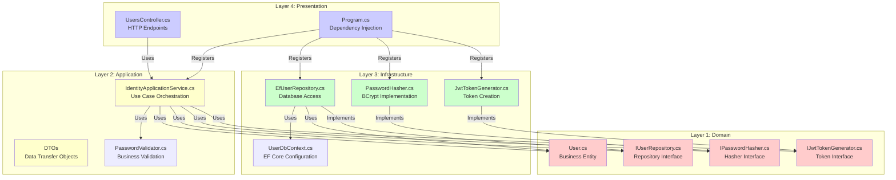
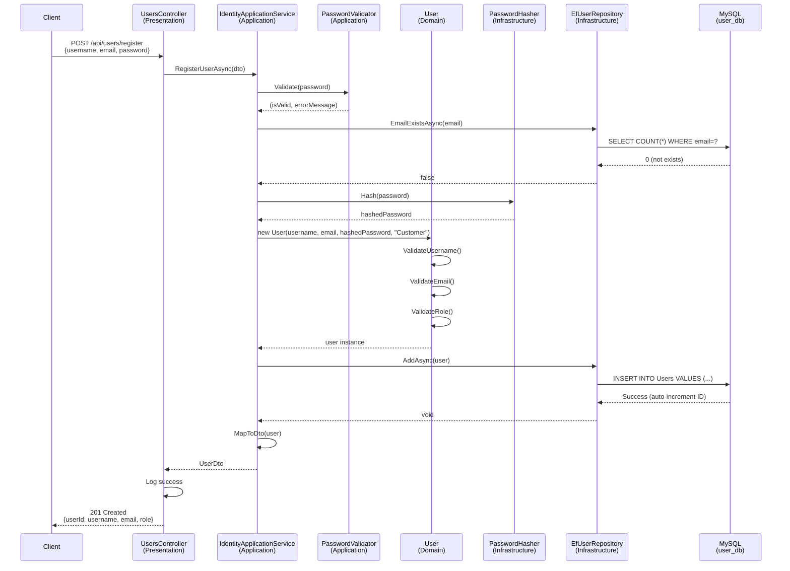
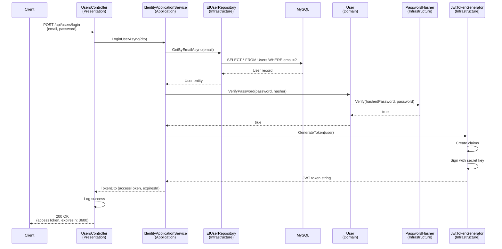

# Architecture Layer 2: UserService Deep Dive

## What You'll Learn

This document zooms into UserService to explain Clean Architecture in practice. You'll understand:
- How the 4-layer architecture works in real code
- What each layer does and why
- How data flows through the layers
- Where business rules live vs technical implementation

## Clean Architecture Overview



**Dependency Rule:** Dependencies point INWARD only
- Domain has ZERO dependencies
- Application depends only on Domain
- Infrastructure depends on Application and Domain
- Presentation depends on all layers

## Layer 1: Domain Layer

**Location:** `src/Services/UserService/LibHub.UserService.Domain/`

**Purpose:** Contains business entities and rules. NO external dependencies.

### Files Structure
```
LibHub.UserService.Domain/
├── User.cs                    # Core business entity
├── IUserRepository.cs         # Repository contract
├── IPasswordHasher.cs         # Password hashing contract
└── Exceptions/
    ├── DomainException.cs
    └── ValidationException.cs
```

### User Entity (User.cs)

**Key Responsibilities:**
- Encapsulate user data
- Enforce business rules
- Validate data integrity
- Provide domain methods

**Code Walkthrough:**

```csharp
public class User
{
    // Properties with private setters - encapsulation
    public int UserId { get; private set; }
    public string Username { get; private set; } = string.Empty;
    public string Email { get; private set; } = string.Empty;
    public string HashedPassword { get; private set; } = string.Empty;
    public string Role { get; private set; } = string.Empty;
    public DateTime CreatedAt { get; private set; }
    public DateTime? UpdatedAt { get; private set; }

    // Private constructor for EF Core
    private User() { }

    // Public constructor enforces validation
    public User(string username, string email, string hashedPassword, string role)
    {
        ValidateUsername(username);      // Business rule
        ValidateEmail(email);            // Business rule
        ValidateRole(role);              // Business rule
        ValidateHashedPassword(hashedPassword);

        Username = username;
        Email = email.ToLowerInvariant(); // Normalize email
        HashedPassword = hashedPassword;
        Role = role;
        CreatedAt = DateTime.UtcNow;
    }

    // Domain method - business logic
    public bool VerifyPassword(string plainPassword, IPasswordHasher passwordHasher)
    {
        if (string.IsNullOrWhiteSpace(plainPassword))
            return false;

        return passwordHasher.Verify(HashedPassword, plainPassword);
    }

    // Domain method - update with validation
    public void UpdateProfile(string username, string email)
    {
        ValidateUsername(username);
        ValidateEmail(email);

        Username = username;
        Email = email.ToLowerInvariant();
        UpdatedAt = DateTime.UtcNow;
    }

    // Business rule: Username constraints
    private static void ValidateUsername(string username)
    {
        if (string.IsNullOrWhiteSpace(username))
            throw new ArgumentException("Username is required", nameof(username));

        if (username.Length < 2)
            throw new ArgumentException("Username must be at least 2 characters");

        if (username.Length > 100)
            throw new ArgumentException("Username cannot exceed 100 characters");
    }

    // Business rule: Email constraints
    private static void ValidateEmail(string email)
    {
        if (string.IsNullOrWhiteSpace(email))
            throw new ArgumentException("Email is required", nameof(email));

        if (!email.Contains('@') || !email.Contains('.'))
            throw new ArgumentException("Email format is invalid");

        if (email.Length > 255)
            throw new ArgumentException("Email cannot exceed 255 characters");
    }

    // Business rule: Only Customer or Admin roles allowed
    private static void ValidateRole(string role)
    {
        if (string.IsNullOrWhiteSpace(role))
            throw new ArgumentException("Role is required", nameof(role));

        if (role != "Customer" && role != "Admin")
            throw new ArgumentException("Role must be either 'Customer' or 'Admin'");
    }

    // Helper methods
    public bool IsAdmin() => Role == "Admin";
    public bool IsCustomer() => Role == "Customer";
}
```

**Key Design Decisions:**
1. **Private setters** - prevents external modification, maintains invariants
2. **Validation in constructor** - ensures entity is always in valid state
3. **Domain methods** - business logic lives in the entity (VerifyPassword, UpdateProfile)
4. **No dependencies** - pure C# code, no frameworks

### Repository Interface (IUserRepository.cs)

**Purpose:** Define contract for data access WITHOUT specifying implementation

```csharp
public interface IUserRepository
{
    Task<User?> GetByIdAsync(int userId);
    Task<User?> GetByEmailAsync(string email);
    Task<bool> EmailExistsAsync(string email);
    Task AddAsync(User user);
    Task UpdateAsync(User user);
    Task<List<User>> GetAllAsync();
}
```

**Why interface in Domain?**
- Domain defines WHAT data access it needs
- Infrastructure provides HOW (EF Core, Dapper, etc.)
- Enables dependency inversion principle
- Makes testing easier (mock the interface)

## Layer 2: Application Layer

**Location:** `src/Services/UserService/LibHub.UserService.Application/`

**Purpose:** Orchestrate use cases, coordinate between domain and infrastructure

### Files Structure
```
LibHub.UserService.Application/
├── Services/
│   └── IdentityApplicationService.cs    # Main orchestrator
├── DTOs/
│   ├── RegisterUserDto.cs               # Input for registration
│   ├── LoginDto.cs                      # Input for login
│   ├── UserDto.cs                       # Output for user data
│   └── TokenDto.cs                      # Output for JWT token
├── Interfaces/
│   └── IJwtTokenGenerator.cs            # Token generation contract
└── Validation/
    └── PasswordValidator.cs             # Password complexity rules
```

### IdentityApplicationService.cs

**Purpose:** Implement use cases (Register, Login, GetUser)

**Code Walkthrough - Register Use Case:**

```csharp
public class IdentityApplicationService
{
    private readonly IUserRepository _userRepository;
    private readonly IPasswordHasher _passwordHasher;
    private readonly IJwtTokenGenerator _jwtTokenGenerator;

    // Constructor injection - dependencies provided by DI container
    public IdentityApplicationService(
        IUserRepository userRepository,
        IPasswordHasher passwordHasher,
        IJwtTokenGenerator jwtTokenGenerator)
    {
        _userRepository = userRepository;
        _passwordHasher = passwordHasher;
        _jwtTokenGenerator = jwtTokenGenerator;
    }

    // Use Case: Register New User
    public async Task<UserDto> RegisterUserAsync(RegisterUserDto dto)
    {
        // Step 1: Validate password complexity
        var (isValid, errorMessage) = PasswordValidator.Validate(dto.Password);
        if (!isValid)
            throw new ArgumentException(errorMessage);

        // Step 2: Check email uniqueness (business rule)
        if (await _userRepository.EmailExistsAsync(dto.Email))
            throw new InvalidOperationException("Email already exists");

        // Step 3: Hash password (security requirement)
        var hashedPassword = _passwordHasher.Hash(dto.Password);

        // Step 4: Create domain entity (enforces validation)
        var user = new User(dto.Username, dto.Email, hashedPassword, "Customer");

        // Step 5: Persist to database
        await _userRepository.AddAsync(user);

        // Step 6: Return DTO (don't expose domain entity)
        return MapToDto(user);
    }

    // Use Case: Login User
    public async Task<TokenDto> LoginUserAsync(LoginDto dto)
    {
        // Step 1: Find user by email
        var user = await _userRepository.GetByEmailAsync(dto.Email);
        if (user == null)
            throw new UnauthorizedAccessException("Invalid email or password");

        // Step 2: Verify password using domain method
        if (!user.VerifyPassword(dto.Password, _passwordHasher))
            throw new UnauthorizedAccessException("Invalid email or password");

        // Step 3: Generate JWT token
        var token = _jwtTokenGenerator.GenerateToken(user);

        // Step 4: Return token DTO
        return new TokenDto
        {
            AccessToken = token,
            ExpiresIn = 3600  // 1 hour
        };
    }

    // Use Case: Get User by ID
    public async Task<UserDto?> GetUserByIdAsync(int userId)
    {
        var user = await _userRepository.GetByIdAsync(userId);
        return user != null ? MapToDto(user) : null;
    }

    // Helper: Map domain entity to DTO
    private static UserDto MapToDto(User user)
    {
        return new UserDto
        {
            UserId = user.UserId,
            Username = user.Username,
            Email = user.Email,
            Role = user.Role,
            CreatedAt = user.CreatedAt
            // Note: HashedPassword is NOT exposed
        };
    }
}
```

**Key Responsibilities:**
1. **Orchestrate workflow** - coordinate multiple steps
2. **Validate input** - password complexity, email uniqueness
3. **Call domain methods** - user.VerifyPassword()
4. **Use infrastructure** - repository, hasher, token generator
5. **Map to DTOs** - don't expose domain entities to API

### DTOs (Data Transfer Objects)

**Purpose:** Define data contracts for API communication

**RegisterUserDto.cs** - Input from client:
```csharp
public class RegisterUserDto
{
    public string Username { get; set; } = string.Empty;
    public string Email { get; set; } = string.Empty;
    public string Password { get; set; } = string.Empty;  // Plain text from client
}
```

**UserDto.cs** - Output to client:
```csharp
public class UserDto
{
    public int UserId { get; set; }
    public string Username { get; set; } = string.Empty;
    public string Email { get; set; } = string.Empty;
    public string Role { get; set; } = string.Empty;
    public DateTime CreatedAt { get; set; }
    // Note: NO HashedPassword - security!
}
```

**Why DTOs?**
- Decouple API contracts from domain entities
- Control what data is exposed
- Allow different representations for different use cases
- Enable API versioning without changing domain

## Layer 3: Infrastructure Layer

**Location:** `src/Services/UserService/LibHub.UserService.Infrastructure/`

**Purpose:** Implement technical concerns (database, security, external services)

### Files Structure
```
LibHub.UserService.Infrastructure/
├── Repositories/
│   └── EfUserRepository.cs              # EF Core implementation
├── Security/
│   ├── PasswordHasher.cs                # BCrypt implementation
│   └── JwtTokenGenerator.cs             # JWT token creation
├── UserDbContext.cs                     # EF Core DbContext
└── DesignTimeDbContextFactory.cs        # For migrations
```

### EfUserRepository.cs

**Purpose:** Implement IUserRepository using Entity Framework Core

```csharp
public class EfUserRepository : IUserRepository
{
    private readonly UserDbContext _context;

    public EfUserRepository(UserDbContext context)
    {
        _context = context;
    }

    public async Task<User?> GetByIdAsync(int userId)
    {
        // EF Core FindAsync - optimized for primary key lookup
        return await _context.Users.FindAsync(userId);
    }

    public async Task<User?> GetByEmailAsync(string email)
    {
        // Case-insensitive email search
        return await _context.Users
            .FirstOrDefaultAsync(u => u.Email == email.ToLower());
    }

    public async Task<bool> EmailExistsAsync(string email)
    {
        // Efficient existence check (doesn't load entity)
        return await _context.Users
            .AnyAsync(u => u.Email == email.ToLower());
    }

    public async Task AddAsync(User user)
    {
        await _context.Users.AddAsync(user);
        await _context.SaveChangesAsync();  // Persist to MySQL
    }

    public async Task UpdateAsync(User user)
    {
        _context.Users.Update(user);
        await _context.SaveChangesAsync();
    }

    public async Task<List<User>> GetAllAsync()
    {
        return await _context.Users.ToListAsync();
    }
}
```

**Key Points:**
- Implements interface from Domain layer
- Uses EF Core for database operations
- Handles MySQL-specific concerns
- Translates domain operations to SQL queries

### PasswordHasher.cs

**Purpose:** Implement password hashing using BCrypt

```csharp
public class PasswordHasher : IPasswordHasher
{
    private const int WorkFactor = 11;  // BCrypt complexity

    public string Hash(string password)
    {
        if (string.IsNullOrWhiteSpace(password))
            throw new ArgumentException("Password cannot be empty");

        // BCrypt.Net library - industry standard
        return BCrypt.Net.BCrypt.HashPassword(password, WorkFactor);
    }

    public bool Verify(string hash, string password)
    {
        if (string.IsNullOrWhiteSpace(hash) || string.IsNullOrWhiteSpace(password))
            return false;

        try
        {
            return BCrypt.Net.BCrypt.Verify(password, hash);
        }
        catch
        {
            return false;  // Invalid hash format
        }
    }
}
```

**Why BCrypt?**
- Slow by design (prevents brute force)
- Built-in salt (prevents rainbow tables)
- Work factor 11 = ~100ms per hash (good balance)

### JwtTokenGenerator.cs

**Purpose:** Create JWT tokens for authentication

```csharp
public class JwtTokenGenerator : IJwtTokenGenerator
{
    private readonly IConfiguration _configuration;

    public JwtTokenGenerator(IConfiguration configuration)
    {
        _configuration = configuration;
    }

    public string GenerateToken(User user)
    {
        // Get secret key from configuration
        var secretKey = _configuration["Jwt:SecretKey"]
            ?? throw new InvalidOperationException("JWT SecretKey not configured");

        var key = new SymmetricSecurityKey(Encoding.UTF8.GetBytes(secretKey));
        var credentials = new SigningCredentials(key, SecurityAlgorithms.HmacSha256);

        // Create claims (user information in token)
        var claims = new[]
        {
            new Claim(ClaimTypes.NameIdentifier, user.UserId.ToString()),
            new Claim(ClaimTypes.Email, user.Email),
            new Claim(ClaimTypes.Name, user.Username),
            new Claim(ClaimTypes.Role, user.Role),  // For authorization
            new Claim(JwtRegisteredClaimNames.Jti, Guid.NewGuid().ToString())
        };

        // Create token
        var token = new JwtSecurityToken(
            issuer: _configuration["Jwt:Issuer"],
            audience: _configuration["Jwt:Audience"],
            claims: claims,
            expires: DateTime.UtcNow.AddHours(1),  // 1 hour expiry
            signingCredentials: credentials
        );

        return new JwtSecurityTokenHandler().WriteToken(token);
    }
}
```

**Token Contents:**
- UserId - identify the user
- Email - user's email
- Username - display name
- Role - for authorization (Customer/Admin)
- Expiry - 1 hour from creation

## Layer 4: Presentation Layer

**Location:** `src/Services/UserService/LibHub.UserService.Api/`

**Purpose:** Expose HTTP API, handle requests/responses, configure middleware

### Files Structure
```
LibHub.UserService.Api/
├── Controllers/
│   └── UsersController.cs               # HTTP endpoints
├── Program.cs                           # App startup & DI
└── appsettings.json                     # Configuration
```

### UsersController.cs

**Purpose:** Define HTTP endpoints and handle HTTP concerns

```csharp
[ApiController]
[Route("api/users")]
public class UsersController : ControllerBase
{
    private readonly IdentityApplicationService _identityService;
    private readonly ILogger<UsersController> _logger;

    public UsersController(
        IdentityApplicationService identityService,
        ILogger<UsersController> logger)
    {
        _identityService = identityService;
        _logger = logger;
    }

    // POST /api/users/register
    [HttpPost("register")]
    [ProducesResponseType(typeof(UserDto), StatusCodes.Status201Created)]
    [ProducesResponseType(StatusCodes.Status400BadRequest)]
    public async Task<IActionResult> Register([FromBody] RegisterUserDto dto)
    {
        try
        {
            // Call application service
            var user = await _identityService.RegisterUserAsync(dto);
            
            // Log success
            _logger.LogInformation("User registered: {Email}", user.Email);
            
            // Return 201 Created with Location header
            return CreatedAtAction(nameof(GetUserById), 
                new { id = user.UserId }, user);
        }
        catch (ArgumentException ex)
        {
            // Validation error - 400 Bad Request
            _logger.LogWarning("Registration validation failed: {Message}", ex.Message);
            return BadRequest(new { message = ex.Message });
        }
        catch (InvalidOperationException ex)
        {
            // Business rule violation - 400 Bad Request
            _logger.LogWarning("Registration failed: {Message}", ex.Message);
            return BadRequest(new { message = ex.Message });
        }
        catch (Exception ex)
        {
            // Unexpected error - 500 Internal Server Error
            _logger.LogError(ex, "Registration error");
            return StatusCode(500, new { message = "An error occurred" });
        }
    }

    // POST /api/users/login
    [HttpPost("login")]
    [ProducesResponseType(typeof(TokenDto), StatusCodes.Status200OK)]
    [ProducesResponseType(StatusCodes.Status401Unauthorized)]
    public async Task<IActionResult> Login([FromBody] LoginDto dto)
    {
        try
        {
            var token = await _identityService.LoginUserAsync(dto);
            _logger.LogInformation("User logged in: {Email}", dto.Email);
            
            return Ok(token);  // 200 OK
        }
        catch (UnauthorizedAccessException ex)
        {
            _logger.LogWarning("Login failed: {Message}", ex.Message);
            return Unauthorized(new { message = "Invalid email or password" });
        }
        catch (Exception ex)
        {
            _logger.LogError(ex, "Login error");
            return StatusCode(500, new { message = "An error occurred" });
        }
    }

    // GET /api/users/{id}
    [HttpGet("{id}")]
    [Authorize]  // Requires JWT token
    [ProducesResponseType(typeof(UserDto), StatusCodes.Status200OK)]
    [ProducesResponseType(StatusCodes.Status404NotFound)]
    public async Task<IActionResult> GetUserById(int id)
    {
        var user = await _identityService.GetUserByIdAsync(id);
        
        if (user == null)
            return NotFound(new { message = "User not found" });
        
        return Ok(user);
    }

    // GET /api/users/me
    [HttpGet("me")]
    [Authorize]  // Requires JWT token
    public async Task<IActionResult> GetCurrentUser()
    {
        // Extract user ID from JWT claims
        var userIdClaim = User.FindFirst(ClaimTypes.NameIdentifier);
        if (userIdClaim == null)
            return Unauthorized();

        var userId = int.Parse(userIdClaim.Value);
        var user = await _identityService.GetUserByIdAsync(userId);
        
        if (user == null)
            return NotFound(new { message = "User not found" });
        
        return Ok(user);
    }
}
```

**Controller Responsibilities:**
1. **Route HTTP requests** - [HttpPost], [HttpGet] attributes
2. **Validate input** - [FromBody] model binding
3. **Call application service** - delegate business logic
4. **Handle exceptions** - convert to appropriate HTTP status codes
5. **Log events** - audit trail
6. **Return responses** - Ok(), BadRequest(), Unauthorized(), etc.

### Program.cs - Dependency Injection

**Purpose:** Configure services and middleware pipeline

```csharp
var builder = WebApplication.CreateBuilder(args);

// Add controllers
builder.Services.AddControllers();

// Add Swagger for API documentation
builder.Services.AddSwaggerGen(/* configuration */);

// Configure EF Core with MySQL
builder.Services.AddDbContext<UserDbContext>(options =>
    options.UseMySql(
        builder.Configuration.GetConnectionString("DefaultConnection"),
        ServerVersion.AutoDetect(/* connection string */)
    ));

// Configure JWT authentication
builder.Services.AddAuthentication(JwtBearerDefaults.AuthenticationScheme)
    .AddJwtBearer(options =>
    {
        options.TokenValidationParameters = new TokenValidationParameters
        {
            ValidateIssuer = true,
            ValidateAudience = true,
            ValidateLifetime = true,
            ValidateIssuerSigningKey = true,
            ValidIssuer = builder.Configuration["Jwt:Issuer"],
            ValidAudience = builder.Configuration["Jwt:Audience"],
            IssuerSigningKey = new SymmetricSecurityKey(
                Encoding.UTF8.GetBytes(builder.Configuration["Jwt:SecretKey"]))
        };
    });

// Configure CORS
builder.Services.AddCors(options =>
{
    options.AddDefaultPolicy(policy =>
    {
        policy.AllowAnyOrigin()
              .AllowAnyMethod()
              .AllowAnyHeader();
    });
});

// Register application services (DEPENDENCY INJECTION)
builder.Services.AddScoped<IdentityApplicationService>();
builder.Services.AddScoped<IUserRepository, EfUserRepository>();
builder.Services.AddSingleton<IPasswordHasher, PasswordHasher>();
builder.Services.AddSingleton<IJwtTokenGenerator, JwtTokenGenerator>();

// Add health checks
builder.Services.AddHealthChecks();

var app = builder.Build();

// Configure middleware pipeline
app.UseCors();
app.UseAuthentication();  // JWT validation
app.UseAuthorization();   // Role-based access
app.MapHealthChecks("/health");
app.MapControllers();

app.Run();  // Start listening on port 5002
```

**Dependency Injection Lifetimes:**
- **Scoped** - One instance per HTTP request (IdentityApplicationService, EfUserRepository)
- **Singleton** - One instance for entire application (PasswordHasher, JwtTokenGenerator)
- **Transient** - New instance every time (not used here)

## Data Flow Through Layers

### Example: User Registration Flow



### Example: User Login Flow



## Key Takeaways

### Clean Architecture Benefits
1. **Separation of Concerns** - Each layer has clear responsibility
2. **Testability** - Can test business logic without database
3. **Maintainability** - Changes in one layer don't affect others
4. **Flexibility** - Can swap implementations (EF Core → Dapper)

### Layer Responsibilities Summary

| Layer | Purpose | Dependencies | Examples |
|-------|---------|--------------|----------|
| **Domain** | Business rules | NONE | User.cs, IUserRepository.cs |
| **Application** | Use case orchestration | Domain only | IdentityApplicationService.cs |
| **Infrastructure** | Technical implementation | Application + Domain | EfUserRepository.cs, PasswordHasher.cs |
| **Presentation** | HTTP API | All layers | UsersController.cs, Program.cs |

### Dependency Flow
- **Interfaces defined in Domain/Application** (what we need)
- **Implementations in Infrastructure** (how we do it)
- **Wired together in Presentation** (dependency injection)

### Key Design Patterns Used
1. **Repository Pattern** - Abstract data access
2. **Dependency Injection** - Loose coupling
3. **DTO Pattern** - Decouple API from domain
4. **Factory Pattern** - User entity construction with validation

## Next Steps

Now that you understand how UserService implements Clean Architecture:
- **Layer 3**: Learn how dependency injection wires everything together at runtime
- **Layer 4**: Explore how LoanService communicates with CatalogService
- **Layer 5**: Walk through complete end-to-end scenarios


