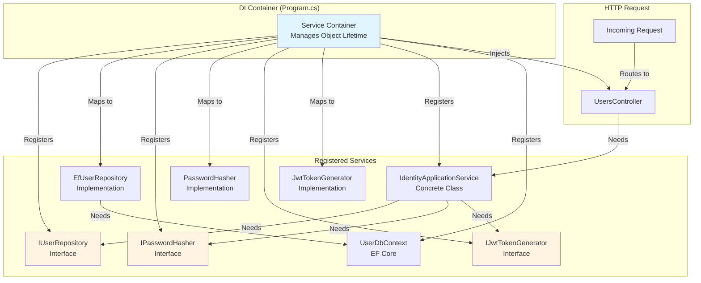
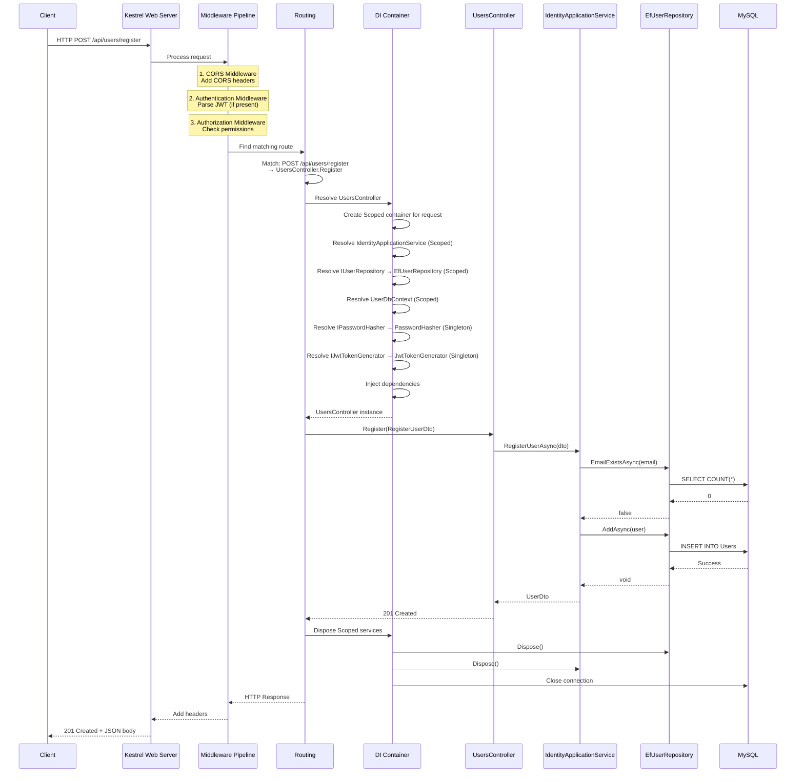

$$# Architecture Layer 3: Dependency Flow & Injection

## What You'll Learn

This document explains how all the pieces wire together at runtime. You'll understand:
- How dependency injection works in ASP.NET Core
- Request lifecycle from HTTP to database and back
- How interfaces get resolved to implementations
- Configuration and middleware pipeline

## Dependency Injection Overview



## Service Registration in Program.cs

### Complete Registration Code

```csharp
var builder = WebApplication.CreateBuilder(args);

// ============================================
// 1. FRAMEWORK SERVICES
// ============================================

// Add MVC controllers
builder.Services.AddControllers();

// Add API documentation
builder.Services.AddEndpointsApiExplorer();
builder.Services.AddSwaggerGen(c =>
{
    c.SwaggerDoc("v1", new OpenApiInfo 
    { 
        Title = "UserService API", 
        Version = "v1" 
    });
    
    // Configure JWT in Swagger
    c.AddSecurityDefinition("Bearer", new OpenApiSecurityScheme
    {
        Description = "JWT Authorization header using Bearer scheme",
        Name = "Authorization",
        In = ParameterLocation.Header,
        Type = SecuritySchemeType.ApiKey,
        Scheme = "Bearer"
    });
    
    c.AddSecurityRequirement(new OpenApiSecurityRequirement
    {
        {
            new OpenApiSecurityScheme
            {
                Reference = new OpenApiReference
                {
                    Type = ReferenceType.SecurityScheme,
                    Id = "Bearer"
                }
            },
            Array.Empty<string>()
        }
    });
});

// ============================================
// 2. DATABASE CONFIGURATION
// ============================================

// Register EF Core DbContext with MySQL
builder.Services.AddDbContext<UserDbContext>(options =>
    options.UseMySql(
        builder.Configuration.GetConnectionString("DefaultConnection"),
        ServerVersion.AutoDetect(
            builder.Configuration.GetConnectionString("DefaultConnection")
        )
    ));

// Connection string from appsettings.json:
// "DefaultConnection": "Server=mysql;Port=3306;Database=user_db;
//                       User=libhub_user;Password=LibHub@Dev2025;"

// ============================================
// 3. AUTHENTICATION & AUTHORIZATION
// ============================================

// Configure JWT Bearer authentication
builder.Services.AddAuthentication(JwtBearerDefaults.AuthenticationScheme)
    .AddJwtBearer(options =>
    {
        options.TokenValidationParameters = new TokenValidationParameters
        {
            ValidateIssuer = true,              // Check token issuer
            ValidateAudience = true,            // Check token audience
            ValidateLifetime = true,            // Check expiration
            ValidateIssuerSigningKey = true,    // Verify signature
            
            // These values must match token generation
            ValidIssuer = builder.Configuration["Jwt:Issuer"],
            ValidAudience = builder.Configuration["Jwt:Audience"],
            IssuerSigningKey = new SymmetricSecurityKey(
                Encoding.UTF8.GetBytes(
                    builder.Configuration["Jwt:SecretKey"] 
                    ?? throw new InvalidOperationException("JWT SecretKey not configured")
                )
            )
        };
    });

builder.Services.AddAuthorization();

// ============================================
// 4. CORS CONFIGURATION
// ============================================

builder.Services.AddCors(options =>
{
    options.AddDefaultPolicy(policy =>
    {
        policy.AllowAnyOrigin()      // Allow requests from any origin
              .AllowAnyMethod()      // Allow GET, POST, PUT, DELETE, etc.
              .AllowAnyHeader();     // Allow any HTTP headers
    });
});

// ============================================
// 5. APPLICATION SERVICES (DEPENDENCY INJECTION)
// ============================================

// Application Layer - Scoped (one instance per HTTP request)
builder.Services.AddScoped<IdentityApplicationService>();

// Infrastructure Layer - Repository (Scoped)
builder.Services.AddScoped<IUserRepository, EfUserRepository>();
// Why Scoped? Repository uses DbContext which is Scoped

// Infrastructure Layer - Security (Singleton)
builder.Services.AddSingleton<IPasswordHasher, PasswordHasher>();
// Why Singleton? Stateless, no dependencies, thread-safe

builder.Services.AddSingleton<IJwtTokenGenerator, JwtTokenGenerator>();
// Why Singleton? Only needs IConfiguration, stateless

// ============================================
// 6. HEALTH CHECKS
// ============================================

builder.Services.AddHealthChecks();

// ============================================
// 7. CONSUL SERVICE DISCOVERY
// ============================================

builder.Services.AddConsulServiceRegistration(builder.Configuration);

// ============================================
// BUILD APPLICATION
// ============================================

var app = builder.Build();

// ============================================
// 8. DATABASE INITIALIZATION
// ============================================

using (var scope = app.Services.CreateScope())
{
    var dbContext = scope.ServiceProvider.GetRequiredService<UserDbContext>();
    try
    {
        dbContext.Database.EnsureCreated();
        app.Logger.LogInformation("Database created successfully");
    }
    catch (Exception ex)
    {
        app.Logger.LogError(ex, "Failed to create database");
        throw;
    }
}

// ============================================
// 9. MIDDLEWARE PIPELINE (ORDER MATTERS!)
// ============================================

if (app.Environment.IsDevelopment())
{
    app.UseSwagger();       // Serve OpenAPI JSON
    app.UseSwaggerUI();     // Serve Swagger UI
}

app.UseCors();              // Enable CORS (must be before Auth)

app.UseAuthentication();    // Validate JWT tokens
app.UseAuthorization();     // Check user permissions

app.MapHealthChecks("/health");  // Health check endpoint
app.MapControllers();            // Map controller routes

app.UseConsulServiceRegistration(app.Configuration, app.Lifetime);

app.Logger.LogInformation("UserService starting on port 5002");

app.Run();  // Start listening for HTTP requests
```

## Service Lifetimes Explained

### Scoped Lifetime

**When to use:** Service depends on per-request state (like DbContext)

```csharp
builder.Services.AddScoped<IdentityApplicationService>();
builder.Services.AddScoped<IUserRepository, EfUserRepository>();
```

**Behavior:**
- One instance created per HTTP request
- Shared across all classes in same request
- Disposed at end of request

**Example:**
```
Request 1: Creates new IdentityApplicationService + EfUserRepository
Request 2: Creates new IdentityApplicationService + EfUserRepository
```

**Why for Repository?**
- EfUserRepository depends on UserDbContext
- DbContext is Scoped (tracks changes per request)
- Repository must be Scoped to match DbContext lifetime

### Singleton Lifetime

**When to use:** Stateless services, thread-safe, no per-request data

```csharp
builder.Services.AddSingleton<IPasswordHasher, PasswordHasher>();
builder.Services.AddSingleton<IJwtTokenGenerator, JwtTokenGenerator>();
```

**Behavior:**
- One instance created for entire application lifetime
- Shared across all requests
- Never disposed until app shutdown

**Example:**
```
Request 1: Uses same PasswordHasher instance
Request 2: Uses same PasswordHasher instance
Request 1000: Uses same PasswordHasher instance
```

**Why for PasswordHasher?**
- No state (stateless)
- No dependencies on per-request data
- Thread-safe (BCrypt library is thread-safe)
- Better performance (no object creation overhead)

### Transient Lifetime

**When to use:** Lightweight, stateless services that are cheap to create

```csharp
builder.Services.AddTransient<IMyService, MyService>();
```

**Behavior:**
- New instance created every time it's requested
- Not used in UserService

## Request Lifecycle

### Complete Request Flow



## Dependency Resolution Example

### Step-by-Step: Creating UsersController

When a request comes in for `/api/users/register`:

**Step 1: Router identifies controller**
```csharp
Route: POST /api/users/register
Controller: UsersController
Action: Register(RegisterUserDto dto)
```

**Step 2: DI Container resolves UsersController**
```csharp
// Controller constructor
public UsersController(
    IdentityApplicationService identityService,  // Needs this
    ILogger<UsersController> logger)             // Needs this
```

**Step 3: DI resolves IdentityApplicationService**
```csharp
// Service constructor
public IdentityApplicationService(
    IUserRepository userRepository,          // Needs this
    IPasswordHasher passwordHasher,          // Needs this
    IJwtTokenGenerator jwtTokenGenerator)    // Needs this
```

**Step 4: DI resolves IUserRepository → EfUserRepository**
```csharp
// Repository constructor
public EfUserRepository(UserDbContext context)  // Needs this
```

**Step 5: DI resolves UserDbContext**
```csharp
// DbContext registered with connection string
options.UseMySql(connectionString, serverVersion)
```

**Step 6: DI resolves IPasswordHasher → PasswordHasher**
```csharp
// Singleton - already created, reuse instance
```

**Step 7: DI resolves IJwtTokenGenerator → JwtTokenGenerator**
```csharp
// Constructor
public JwtTokenGenerator(IConfiguration configuration)  // Needs this

// IConfiguration automatically available (built-in service)
```

**Step 8: All dependencies resolved, create controller**
```csharp
var logger = /* framework provides */;
var configuration = /* framework provides */;
var jwtGenerator = new JwtTokenGenerator(configuration);  // Singleton
var passwordHasher = new PasswordHasher();                // Singleton
var dbContext = new UserDbContext(options);               // Scoped
var repository = new EfUserRepository(dbContext);         // Scoped
var service = new IdentityApplicationService(
    repository, passwordHasher, jwtGenerator);            // Scoped
var controller = new UsersController(service, logger);    // Scoped

// Now execute: controller.Register(dto)
```

## Middleware Pipeline

### Middleware Execution Order

```mermaid
graph TB
    Request[HTTP Request]
    
    Request --> CORS[CORS Middleware<br/>Add headers]
    CORS --> Auth[Authentication Middleware<br/>Parse & validate JWT]
    Auth --> Authz[Authorization Middleware<br/>Check [Authorize] attributes]
    Authz --> Routing[Routing Middleware<br/>Match URL to controller]
    Routing --> Controller[Controller Execution<br/>Run action method]
    
    Controller --> Response[Generate Response]
    Response --> Authz2[Authorization]
    Authz2 --> Auth2[Authentication]
    Auth2 --> CORS2[CORS]
    CORS2 --> FinalResponse[HTTP Response]
    
    style Request fill:#e1f5ff
    style FinalResponse fill:#e1f5ff
    style Controller fill:#fff4e1
```

### Middleware Responsibilities

**1. CORS Middleware**
```csharp
app.UseCors();
```
- Adds `Access-Control-Allow-Origin: *` header
- Handles preflight OPTIONS requests
- Must come BEFORE authentication

**2. Authentication Middleware**
```csharp
app.UseAuthentication();
```
- Parses `Authorization: Bearer <token>` header
- Validates JWT signature and expiration
- Populates `HttpContext.User` with claims
- Does NOT block requests (that's Authorization's job)

**3. Authorization Middleware**
```csharp
app.UseAuthorization();
```
- Checks `[Authorize]` attributes on controllers/actions
- Verifies user has required roles
- Returns 401 Unauthorized if not authenticated
- Returns 403 Forbidden if not authorized

**4. Endpoint Routing**
```csharp
app.MapControllers();
```
- Matches URL to controller action
- Extracts route parameters
- Invokes controller through DI

## Configuration Management

### appsettings.json Structure

```json
{
  "ConnectionStrings": {
    "DefaultConnection": "Server=mysql;Port=3306;Database=user_db;User=libhub_user;Password=LibHub@Dev2025;"
  },
  "Jwt": {
    "SecretKey": "YourSuperSecretKeyThatIsAtLeast32CharactersLongForHS256Algorithm",
    "Issuer": "LibHub.UserService",
    "Audience": "LibHub.Client",
    "ExpiryInHours": "1"
  },
  "Consul": {
    "Host": "consul",
    "Port": 8500,
    "ServiceName": "userservice",
    "ServiceHost": "userservice",
    "ServicePort": 5002
  },
  "Logging": {
    "LogLevel": {
      "Default": "Information",
      "Microsoft.AspNetCore": "Warning"
    }
  }
}
```

### Accessing Configuration

**In Program.cs:**
```csharp
var connectionString = builder.Configuration.GetConnectionString("DefaultConnection");
var jwtSecret = builder.Configuration["Jwt:SecretKey"];
```

**In Services (via DI):**
```csharp
public class JwtTokenGenerator : IJwtTokenGenerator
{
    private readonly IConfiguration _configuration;

    public JwtTokenGenerator(IConfiguration configuration)
    {
        _configuration = configuration;  // Injected by DI
    }

    public string GenerateToken(User user)
    {
        var secretKey = _configuration["Jwt:SecretKey"];
        var issuer = _configuration["Jwt:Issuer"];
        // ...
    }
}
```

## Environment-Specific Configuration

### Development vs Production

**appsettings.Development.json** (overrides base settings):
```json
{
  "ConnectionStrings": {
    "DefaultConnection": "Server=localhost;Port=3306;Database=user_db;..."
  },
  "Logging": {
    "LogLevel": {
      "Default": "Debug",
      "Microsoft.AspNetCore": "Information"
    }
  }
}
```

**Docker Environment Variables** (highest priority):
```yaml
# docker-compose.yml
userservice:
  environment:
    - ConnectionStrings__DefaultConnection=Server=mysql;Port=3306;...
    - Jwt__SecretKey=${JWT_SECRET}
```

**Priority Order (highest to lowest):**
1. Environment variables
2. appsettings.{Environment}.json
3. appsettings.json
4. Command-line arguments

## Dependency Injection Best Practices

### DO: Constructor Injection

```csharp
public class UsersController : ControllerBase
{
    private readonly IdentityApplicationService _service;
    
    // Dependencies injected via constructor
    public UsersController(IdentityApplicationService service)
    {
        _service = service;
    }
}
```

### DON'T: Service Locator Pattern

```csharp
// BAD - Don't do this
public class UsersController : ControllerBase
{
    public IActionResult Register()
    {
        var service = HttpContext.RequestServices
            .GetRequiredService<IdentityApplicationService>();
        // ...
    }
}
```

### DO: Depend on Interfaces

```csharp
public class IdentityApplicationService
{
    private readonly IUserRepository _repository;  // Interface
    
    public IdentityApplicationService(IUserRepository repository)
    {
        _repository = repository;
    }
}
```

### DON'T: Depend on Concrete Classes

```csharp
// BAD - Tightly coupled
public class IdentityApplicationService
{
    private readonly EfUserRepository _repository;  // Concrete class
    
    public IdentityApplicationService(EfUserRepository repository)
    {
        _repository = repository;
    }
}
```

## Testing with Dependency Injection

### Unit Testing with Mocks

```csharp
[Fact]
public async Task RegisterUser_ValidData_ReturnsUserDto()
{
    // Arrange - Create mocks
    var mockRepository = new Mock<IUserRepository>();
    var mockHasher = new Mock<IPasswordHasher>();
    var mockJwtGenerator = new Mock<IJwtTokenGenerator>();
    
    mockRepository.Setup(r => r.EmailExistsAsync(It.IsAny<string>()))
        .ReturnsAsync(false);
    
    mockHasher.Setup(h => h.Hash(It.IsAny<string>()))
        .Returns("hashed_password");
    
    // Create service with mocked dependencies
    var service = new IdentityApplicationService(
        mockRepository.Object,
        mockHasher.Object,
        mockJwtGenerator.Object
    );
    
    var dto = new RegisterUserDto 
    { 
        Username = "test", 
        Email = "test@example.com", 
        Password = "Test@1234" 
    };
    
    // Act
    var result = await service.RegisterUserAsync(dto);
    
    // Assert
    Assert.NotNull(result);
    Assert.Equal("test", result.Username);
    mockRepository.Verify(r => r.AddAsync(It.IsAny<User>()), Times.Once);
}
```

## Key Takeaways

### Dependency Injection Benefits
1. **Loose Coupling** - Classes depend on interfaces, not implementations
2. **Testability** - Easy to mock dependencies in unit tests
3. **Maintainability** - Change implementations without changing consumers
4. **Lifetime Management** - Framework handles object creation and disposal

### Service Lifetime Guidelines
- **Scoped** - Services that depend on DbContext or per-request state
- **Singleton** - Stateless services, thread-safe, no per-request data
- **Transient** - Lightweight services, created frequently

### Middleware Order Matters
1. CORS (must be early)
2. Authentication (parse tokens)
3. Authorization (check permissions)
4. Routing (match endpoints)

### Configuration Best Practices
- Store secrets in environment variables (not appsettings.json)
- Use appsettings.Development.json for local overrides
- Inject IConfiguration into services that need it

## Next Steps

Now that you understand how dependencies are wired together:
- **Layer 4**: Learn how services communicate with each other (LoanService → CatalogService)
- **Layer 5**: Walk through complete end-to-end scenarios with all layers working together


