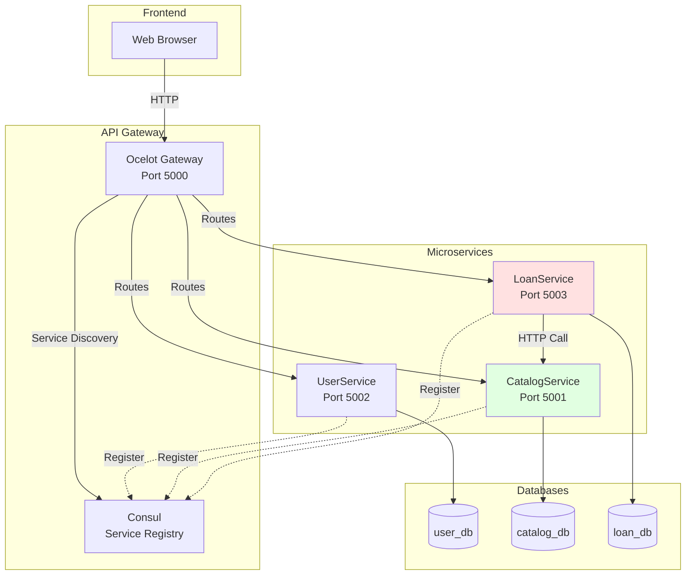
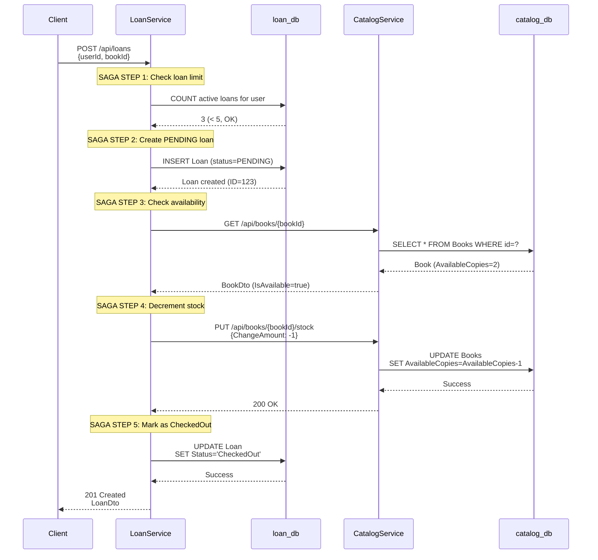
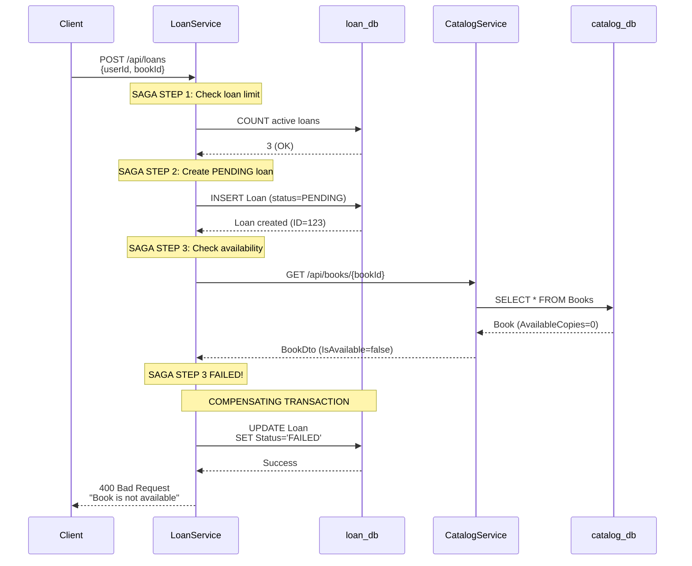
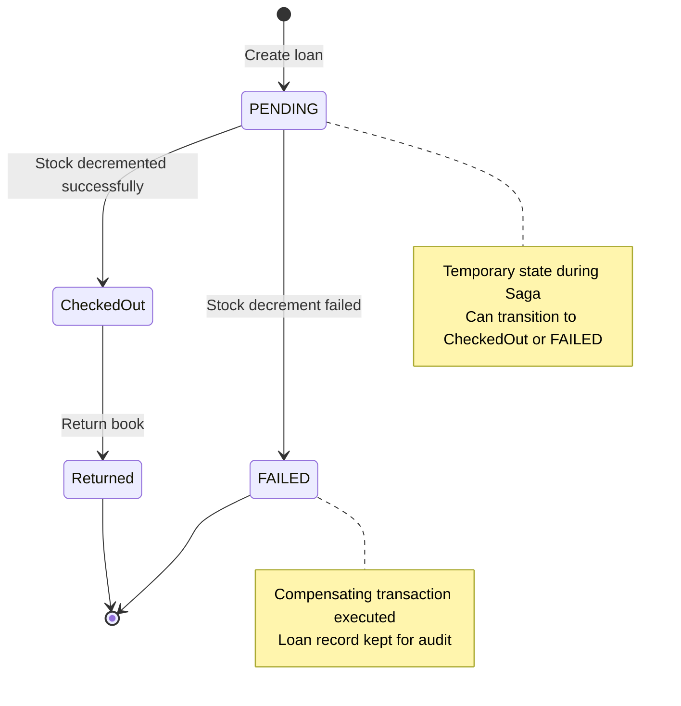
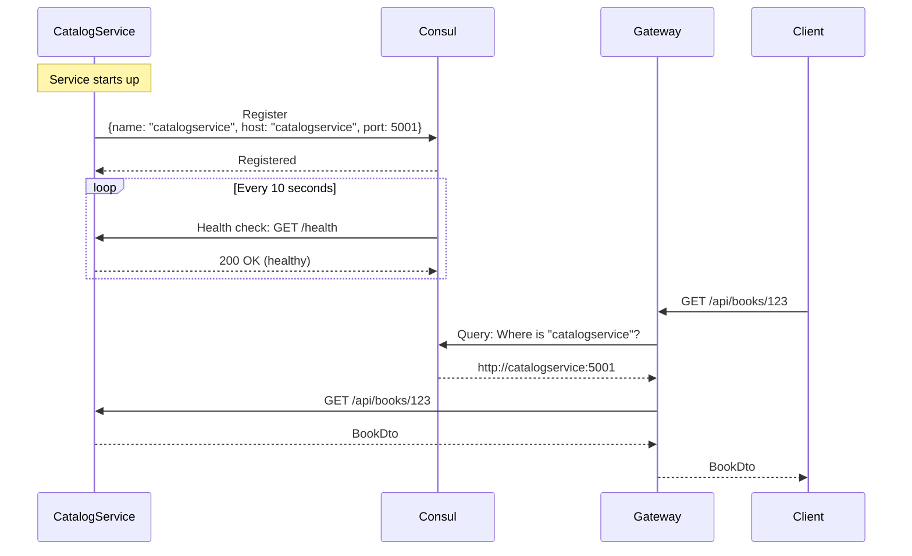
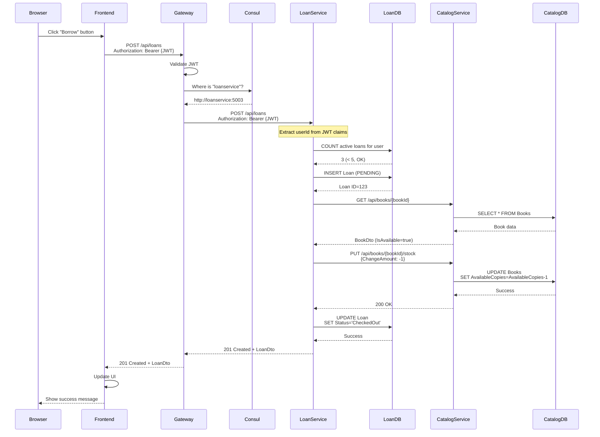

$$# Architecture Layer 4: Inter-Service Communication

## What You'll Learn

This document explains how microservices communicate with each other. You'll understand:
- HTTP-based service-to-service communication
- Saga pattern for distributed transactions
- Compensating transactions for rollback
- Service discovery with Consul
- Error handling across service boundaries

## Inter-Service Communication Overview



**Key Point:** LoanService makes direct HTTP calls to CatalogService (not through Gateway)

## Why Services Need to Communicate

### The Problem: Distributed Data

Each service has its own database:
- **LoanService** knows: UserId, BookId, loan status
- **CatalogService** knows: Book details, stock levels
- **UserService** knows: User details, roles

When borrowing a book, LoanService needs to:
1. Check if book is available (CatalogService data)
2. Decrement book stock (CatalogService operation)
3. Create loan record (LoanService data)

**Solution:** LoanService calls CatalogService via HTTP

## Service Communication Architecture

### HTTP Client Configuration

**Location:** `src/Services/LoanService/LibHub.LoanService.Api/Program.cs`

```csharp
// Register HttpClient for CatalogService
builder.Services.AddHttpClient<ICatalogServiceClient, CatalogServiceHttpClient>(client =>
{
    // Base URL for CatalogService
    var catalogServiceUrl = builder.Configuration["CatalogService:Url"] 
        ?? "http://catalogservice:5001";
    
    client.BaseAddress = new Uri(catalogServiceUrl);
    client.Timeout = TimeSpan.FromSeconds(30);
});

// Register IHttpContextAccessor for JWT forwarding
builder.Services.AddHttpContextAccessor();

// Register application service
builder.Services.AddScoped<LoanApplicationService>();
```

**Configuration in appsettings.json:**
```json
{
  "CatalogService": {
    "Url": "http://catalogservice:5001"
  }
}
```

**Why `catalogservice` hostname?**
- Docker Compose creates DNS entries for container names
- Containers communicate via internal Docker network
- More reliable than IP addresses

## The HTTP Client Implementation

### ICatalogServiceClient Interface

**Location:** `src/Services/LoanService/LibHub.LoanService.Application/Interfaces/ICatalogServiceClient.cs`

```csharp
public interface ICatalogServiceClient
{
    Task<BookDto> GetBookAsync(int bookId);
    Task DecrementStockAsync(int bookId);
    Task IncrementStockAsync(int bookId);
}
```

**Why interface?**
- Abstraction for testing (can mock in unit tests)
- Follows dependency inversion principle
- Application layer doesn't know about HTTP details

### CatalogServiceHttpClient Implementation

**Location:** `src/Services/LoanService/LibHub.LoanService.Infrastructure/HttpClients/CatalogServiceHttpClient.cs`

```csharp
public class CatalogServiceHttpClient : ICatalogServiceClient
{
    private readonly HttpClient _httpClient;
    private readonly ILogger<CatalogServiceHttpClient> _logger;
    private readonly IHttpContextAccessor _httpContextAccessor;

    public CatalogServiceHttpClient(
        HttpClient httpClient, 
        ILogger<CatalogServiceHttpClient> logger, 
        IHttpContextAccessor httpContextAccessor)
    {
        _httpClient = httpClient;  // Injected by framework
        _logger = logger;
        _httpContextAccessor = httpContextAccessor;
    }

    // Forward JWT token from original request
    private void SetAuthorizationHeader()
    {
        var token = _httpContextAccessor.HttpContext?.Request
            .Headers["Authorization"].ToString();
        
        if (!string.IsNullOrEmpty(token))
        {
            _httpClient.DefaultRequestHeaders.Authorization = 
                AuthenticationHeaderValue.Parse(token);
        }
    }

    // GET /api/books/{bookId}
    public async Task<BookDto> GetBookAsync(int bookId)
    {
        try
        {
            // Make HTTP GET request
            var response = await _httpClient.GetAsync($"/api/books/{bookId}");
            
            // Throw if 4xx or 5xx status code
            response.EnsureSuccessStatusCode();

            // Deserialize JSON response to BookDto
            var book = await response.Content.ReadFromJsonAsync<BookDto>();
            
            if (book == null)
                throw new Exception($"Failed to deserialize book data");

            return book;
        }
        catch (Exception ex)
        {
            _logger.LogError(ex, "Failed to get book {BookId}", bookId);
            throw;  // Propagate to caller
        }
    }

    // PUT /api/books/{bookId}/stock
    public async Task DecrementStockAsync(int bookId)
    {
        try
        {
            // Forward JWT token for authorization
            SetAuthorizationHeader();
            
            // Request body: { "ChangeAmount": -1 }
            var stockDto = new { ChangeAmount = -1 };
            
            // Make HTTP PUT request
            var response = await _httpClient.PutAsJsonAsync(
                $"/api/books/{bookId}/stock", 
                stockDto
            );

            if (!response.IsSuccessStatusCode)
            {
                var errorContent = await response.Content.ReadAsStringAsync();
                _logger.LogError(
                    "Failed to decrement stock: {StatusCode} - {Error}", 
                    response.StatusCode, 
                    errorContent
                );
                throw new Exception($"Failed to decrement stock: {response.StatusCode}");
            }
        }
        catch (Exception ex)
        {
            _logger.LogError(ex, "Failed to decrement stock for book {BookId}", bookId);
            throw;  // Critical - must propagate
        }
    }

    // PUT /api/books/{bookId}/stock
    public async Task IncrementStockAsync(int bookId)
    {
        try
        {
            SetAuthorizationHeader();
            
            // Request body: { "ChangeAmount": 1 }
            var stockDto = new { ChangeAmount = 1 };
            
            var response = await _httpClient.PutAsJsonAsync(
                $"/api/books/{bookId}/stock", 
                stockDto
            );

            if (!response.IsSuccessStatusCode)
            {
                var errorContent = await response.Content.ReadAsStringAsync();
                _logger.LogWarning(
                    "Failed to increment stock: {StatusCode} - {Error}", 
                    response.StatusCode, 
                    errorContent
                );
                // Note: Only WARNING, not ERROR
                // Increment failure is less critical than decrement
            }
        }
        catch (Exception ex)
        {
            // Log warning but DON'T throw
            // We don't want return process to fail if stock update fails
            _logger.LogWarning(ex, "Failed to increment stock for book {BookId}", bookId);
        }
    }
}
```

**Key Design Decisions:**

1. **JWT Forwarding** - Pass user's token to CatalogService for authorization
2. **Error Handling** - Decrement throws (critical), increment logs warning (best effort)
3. **Logging** - Comprehensive logging for debugging distributed systems
4. **Timeout** - 30 seconds default (configured in Program.cs)

## The Saga Pattern

### What is a Saga?

A **Saga** is a pattern for managing distributed transactions across multiple services.

**Problem:** Traditional ACID transactions don't work across microservices
- Can't use database transactions across different databases
- No two-phase commit in microservices

**Solution:** Saga pattern
- Break transaction into multiple local transactions
- Each step is committed immediately
- If any step fails, execute compensating transactions to rollback

### Saga Implementation: Borrow Book

**Location:** `src/Services/LoanService/LibHub.LoanService.Application/Services/LoanApplicationService.cs`

```csharp
public async Task<LoanDto> BorrowBookAsync(int userId, CreateLoanDto dto)
{
    _logger.LogInformation("Starting Saga: BorrowBook for UserId={UserId}, BookId={BookId}", 
        userId, dto.BookId);

    // ============================================
    // SAGA STEP 1: Check business rule
    // ============================================
    var activeLoansCount = await _loanRepository.CountActiveLoansForUserAsync(userId);
    if (activeLoansCount >= 5)
    {
        _logger.LogWarning("Saga aborted: User {UserId} has reached max loan limit", userId);
        throw new InvalidOperationException("Maximum loan limit reached (5 active loans)");
    }

    // ============================================
    // SAGA STEP 2: Create PENDING loan
    // ============================================
    var loan = new Loan(userId, dto.BookId);  // Status = "PENDING"
    await _loanRepository.AddAsync(loan);
    _logger.LogInformation("Saga Step 2: Created PENDING loan {LoanId}", loan.LoanId);

    try
    {
        // ============================================
        // SAGA STEP 3: Verify book availability
        // ============================================
        _logger.LogInformation("Saga Step 3: Verifying book availability for BookId={BookId}", 
            dto.BookId);
        
        var book = await _catalogService.GetBookAsync(dto.BookId);
        
        if (!book.IsAvailable)
        {
            _logger.LogWarning("Saga Step 3 failed: Book {BookId} is not available", dto.BookId);
            throw new InvalidOperationException("Book is not available");
        }

        // ============================================
        // SAGA STEP 4: Decrement stock (CRITICAL)
        // ============================================
        _logger.LogInformation("Saga Step 4: Decrementing stock for BookId={BookId}", dto.BookId);
        await _catalogService.DecrementStockAsync(dto.BookId);
        _logger.LogInformation("Saga Step 4: Stock decremented successfully");
    }
    catch (Exception ex)
    {
        // ============================================
        // COMPENSATING TRANSACTION: Rollback
        // ============================================
        _logger.LogError(ex, "Saga failed for BookId={BookId}, executing compensating transaction", 
            dto.BookId);
        
        if (loan.Status == "PENDING")
        {
            loan.MarkAsFailed();  // Status = "FAILED"
            await _loanRepository.UpdateAsync(loan);
            _logger.LogInformation("Saga compensating transaction: Marked loan {LoanId} as FAILED", 
                loan.LoanId);
        }
        
        throw new InvalidOperationException($"Failed to borrow book: {ex.Message}", ex);
    }

    // ============================================
    // SAGA STEP 5: Mark loan as successful
    // ============================================
    loan.MarkAsCheckedOut();  // Status = "CheckedOut"
    await _loanRepository.UpdateAsync(loan);
    _logger.LogInformation("Saga Step 5: Loan {LoanId} marked as CheckedOut - Saga completed", 
        loan.LoanId);

    return MapToDto(loan);
}
```

### Saga Flow Diagram



### Saga Failure & Compensating Transaction



### Loan State Machine



**Loan Domain Entity:**

```csharp
public class Loan
{
    public string Status { get; private set; } = string.Empty;
    
    // Constructor creates PENDING loan
    public Loan(int userId, int bookId)
    {
        UserId = userId;
        BookId = bookId;
        CheckoutDate = DateTime.UtcNow;
        DueDate = CheckoutDate.AddDays(14);  // 14-day loan period
        Status = "PENDING";
    }

    // Saga success path
    public void MarkAsCheckedOut()
    {
        if (Status != "PENDING")
            throw new InvalidOperationException("Can only mark PENDING loans as checked out");
        
        Status = "CheckedOut";
    }

    // Saga failure path (compensating transaction)
    public void MarkAsFailed()
    {
        if (Status != "PENDING")
            throw new InvalidOperationException("Can only mark PENDING loans as failed");
        
        Status = "FAILED";
    }

    // Return book
    public void MarkAsReturned()
    {
        if (Status != "CheckedOut")
            throw new InvalidOperationException("Can only return checked out loans");
        
        Status = "Returned";
        ReturnDate = DateTime.UtcNow;
    }
}
```

## Service Discovery with Consul

### Why Service Discovery?

**Problem:** Hardcoded service URLs are fragile
- Services might move to different hosts
- Load balancing requires multiple instances
- Health checks needed for failover

**Solution:** Consul service registry
- Services register themselves on startup
- Gateway queries Consul to find service instances
- Automatic health checking

### Service Registration

**Each microservice registers with Consul on startup:**

```csharp
// Program.cs in each service
builder.Services.AddConsulServiceRegistration(builder.Configuration);

var app = builder.Build();

// ... middleware configuration ...

app.UseConsulServiceRegistration(app.Configuration, app.Lifetime);
```

**Configuration in appsettings.json:**
```json
{
  "Consul": {
    "Host": "consul",
    "Port": 8500,
    "ServiceName": "catalogservice",
    "ServiceHost": "catalogservice",
    "ServicePort": 5001
  }
}
```

### How Gateway Uses Consul

**Gateway ocelot.json configuration:**

```json
{
  "Routes": [
    {
      "DownstreamPathTemplate": "/api/books/{everything}",
      "DownstreamScheme": "http",
      "UpstreamPathTemplate": "/api/books/{everything}",
      "UpstreamHttpMethod": [ "Get", "Post", "Put", "Delete" ],
      "ServiceName": "catalogservice",
      "LoadBalancerOptions": {
        "Type": "RoundRobin"
      }
    }
  ],
  "GlobalConfiguration": {
    "ServiceDiscoveryProvider": {
      "Host": "consul",
      "Port": 8500,
      "Type": "Consul"
    }
  }
}
```

**How it works:**
1. Gateway receives request for `/api/books/123`
2. Gateway queries Consul: "Where is `catalogservice`?"
3. Consul returns: `http://catalogservice:5001`
4. Gateway forwards request to that address
5. If multiple instances exist, use RoundRobin load balancing

### Service Discovery Flow



## Error Handling Strategies

### Retry Logic (Not Implemented Yet)

**Current:** Single attempt, fail immediately
**Better:** Retry with exponential backoff using Polly library

```csharp
// Future enhancement
builder.Services.AddHttpClient<ICatalogServiceClient, CatalogServiceHttpClient>()
    .AddTransientHttpErrorPolicy(policy => 
        policy.WaitAndRetryAsync(3, retryAttempt => 
            TimeSpan.FromSeconds(Math.Pow(2, retryAttempt))
        )
    );
```

### Circuit Breaker (Not Implemented Yet)

**Current:** Keep trying even if service is down
**Better:** Stop calling failing service temporarily

```csharp
// Future enhancement
.AddTransientHttpErrorPolicy(policy => 
    policy.CircuitBreakerAsync(5, TimeSpan.FromSeconds(30))
);
```

### Timeout Configuration

**Current implementation:**

```csharp
builder.Services.AddHttpClient<ICatalogServiceClient, CatalogServiceHttpClient>(client =>
{
    client.BaseAddress = new Uri(catalogServiceUrl);
    client.Timeout = TimeSpan.FromSeconds(30);  // 30 second timeout
});
```

## Complete Borrow Book Flow

### End-to-End Sequence



## Key Takeaways

### Inter-Service Communication
1. **HTTP/REST** - Services communicate via HTTP calls
2. **HttpClient** - .NET's built-in HTTP client with DI support
3. **JWT Forwarding** - Pass authentication token between services
4. **Service Discovery** - Consul resolves service locations dynamically

### Saga Pattern
1. **Distributed Transactions** - Manage multi-service transactions
2. **Compensating Transactions** - Rollback on failure
3. **PENDING State** - Temporary state during Saga execution
4. **Comprehensive Logging** - Essential for debugging distributed systems

### Design Principles
1. **Interface Abstraction** - ICatalogServiceClient for testability
2. **Error Handling** - Different strategies for critical vs best-effort operations
3. **Idempotency** - Compensating transactions are safe to retry
4. **Audit Trail** - Keep FAILED loan records for debugging

### Trade-offs
1. **Eventual Consistency** - Not ACID, but good enough for most use cases
2. **Network Latency** - HTTP calls are slower than in-process calls
3. **Partial Failures** - More complex error handling than monoliths
4. **Debugging Complexity** - Distributed tracing helps (not implemented yet)

## Next Steps

Now that you understand inter-service communication:
- **Layer 5**: Walk through complete end-to-end scenarios combining all layers


